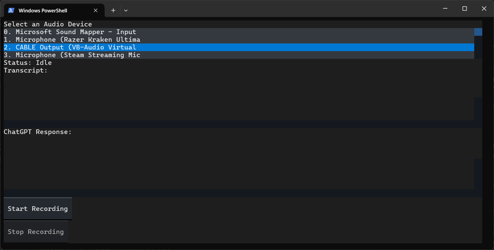

# Real-Time-Transcription

A Python application for real-time audio transcription using Whisper model and summarize using ChatGPT4o, featuring a terminal-based interface built with Textual.

## Interface Screenshot



## Features

- Real-time audio recording, transcription and summarization
- Terminal-based user interface with:
  - Recording status indicator
  - Start/Stop recording controls
  - Live transcription and summarization display
- Save transcriptions and summarization to text files

## Requirements

- Python 3.11+
- CUDA-compatible GPU (recommended)


## Installation

1. Clone the repository
2. Install dependencies:
```bash
pip install -r requirements.txt
```

3. Make sure you have the appropriate audio drivers installed for your system

### CUDA/cuDNN Setup

If you encounter CUDA/cuDNN related errors, follow these steps:

1. Download the required libraries from: [cuBLAS and cuDNN
](https://github.com/Purfview/whisper-standalone-win/releases/tag/libs)
2. Extract the downloaded zip file
3. Place all the extracted DLL files in your project's root directory

This should resolve any cuDNN-related errors you might encounter.

## Usage

1. Run the application:
```bash
python main.py
```

2. Select an audio input device from the list
3. Click "Start Recording" to begin recording and transcribing
4. Click "Stop Recording" to end the session

## Output Files

- `output.wav`: The recorded audio file
- `transcription.txt`: The transcribed text with timestamps

## Requirements.txt

```
textual
pyaudio
torch
numpy
faster-whisper
wave
--extra-index-url https://download.pytorch.org/whl/cu124
torch
torchvision
torchaudio
```

## Notes

- The application uses CUDA acceleration for the Whisper model. Make sure you have the appropriate NVIDIA drivers installed.
- The transcription model uses the "large-v3" model with int8_float16 quantization for optimal performance.
- Audio is recorded at 16kHz with single-channel (mono) for compatibility with the Whisper model.
- Transcription occurs in chunks to provide real-time feedback.

## Error Handling

- If you encounter audio device errors, ensure your input device is properly connected and recognized by your system
- For CUDA-related errors:
  1. First, verify your GPU drivers are up to date
  2. If you get cuDNN errors, follow the CUDA/cuDNN Setup instructions above
  3. Make sure the DLL files are in the correct location
- Make sure you have sufficient disk space for the audio recordings and model files

## Dependencies Explanation

- `textual`: Terminal user interface framework
- `pyaudio`: Audio recording and playback
- `torch`: Required for Whisper model operations
- `numpy`: Audio data processing
- `faster-whisper`: Optimized implementation of OpenAI's Whisper model
- Built-in Python libraries: `wave`, `queue`, `threading`

## System Requirements

- Operating System: Windows/Linux/MacOS
- RAM: Minimum 8GB (16GB recommended)
- Storage: At least 10GB free space for model files
- GPU: NVIDIA GPU with CUDA support (recommended)

## Troubleshooting

Common issues and solutions:

1. **cuDNN Error**: If you see errors related to cuDNN, follow the CUDA/cuDNN Setup section above. This is a common issue that's easily resolved by adding the necessary DLL files to your project directory.

2. **Audio Device Not Found**: Make sure your audio device is properly connected and recognized by your system. The application will show all available audio devices in the selection list.

3. **GPU Memory Error**: If you encounter GPU memory issues, try closing other GPU-intensive applications or consider using a smaller Whisper model by modifying the model size in the code (e.g., change "large-v3" to "medium" or "small").